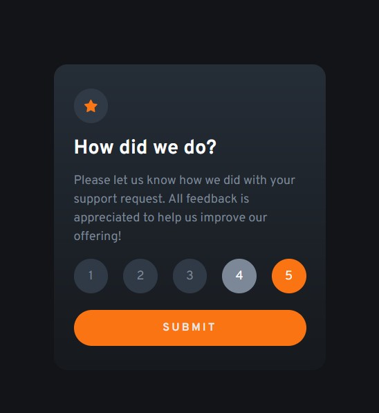

# Frontend Mentor - Interactive rating component solution

This is a solution to the [Interactive rating component challenge on Frontend Mentor](https://www.frontendmentor.io/challenges/interactive-rating-component-koxpeBUmI). Frontend Mentor challenges help you improve your coding skills by building realistic projects. 

### The challenge

Users should be able to:

- View the optimal layout for the app depending on their device's screen size
- See hover states for all interactive elements on the page
- Select and submit a number rating
- See the "Thank you" card state after submitting a rating

### Screenshot

### Links

- Solution URL: [Github repo](https://github.com/KellyCHI22/frontend-mentor-solutions/tree/main/02-interactive-rating-component)
- Live Site URL: [interactive-rating-component](https://kellychi22.github.io/frontend-mentor-solutions/02-interactive-rating-component/)

## My process

### Built with

- Semantic HTML5 markup
- CSS Flexbox
- Vanilla Javascript

## Author

- Website - [My Github homepage](https://github.com/KellyCHI22)
- Frontend Mentor - [@Hsin-tingCHI](https://www.frontendmentor.io/profile/Hsin-tingCHI)

## Acknowledgments

Thank you Frontend Mentor for providing the challenge!