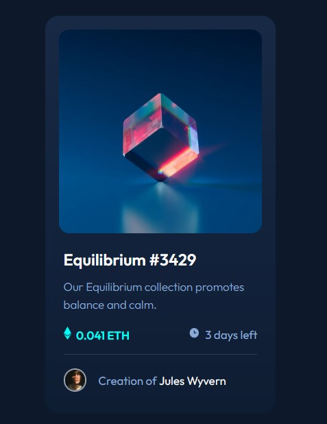
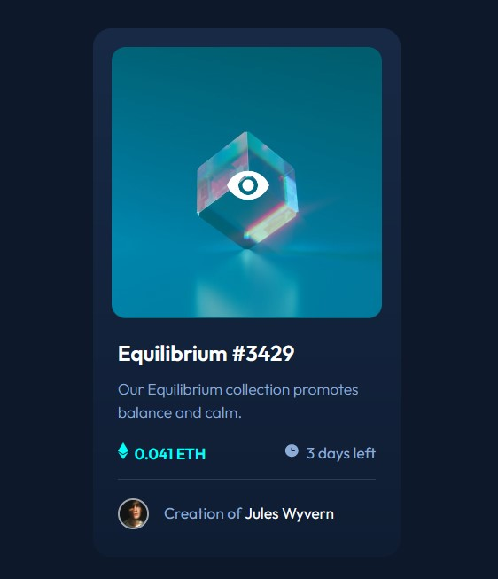

# Frontend Mentor - NFT preview card component solution

This is a solution to the [NFT preview card component challenge on Frontend Mentor](https://www.frontendmentor.io/challenges/nft-preview-card-component-SbdUL_w0U). Frontend Mentor challenges help you improve your coding skills by building realistic projects. 

## The challenge

Users should be able to:

- View the optimal layout depending on their device's screen size
- See hover states for interactive elements

### Screenshot

**Hover state**

### Links

- Solution URL: [Github repo](https://github.com/KellyCHI22/frontend-mentor-solutions/tree/main/04-nft-preview-card-component)
- Live Site URL: [Solution demo](https://kellychi22.github.io/frontend-mentor-solutions/04-nft-preview-card-component/)

### Built with

- Semantic HTML5 markup
- CSS Flexbox
- CSS Grid

## Author

- Website - [My Github homepage](https://github.com/KellyCHI22)
- Frontend Mentor - [@Hsin-tingCHI](https://www.frontendmentor.io/profile/Hsin-tingCHI)

## Acknowledgments

Thank you Frontend Mentor for providing the challenge!
