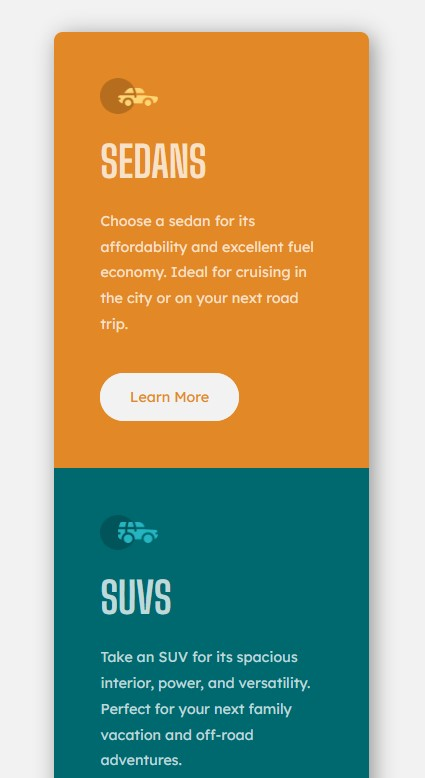
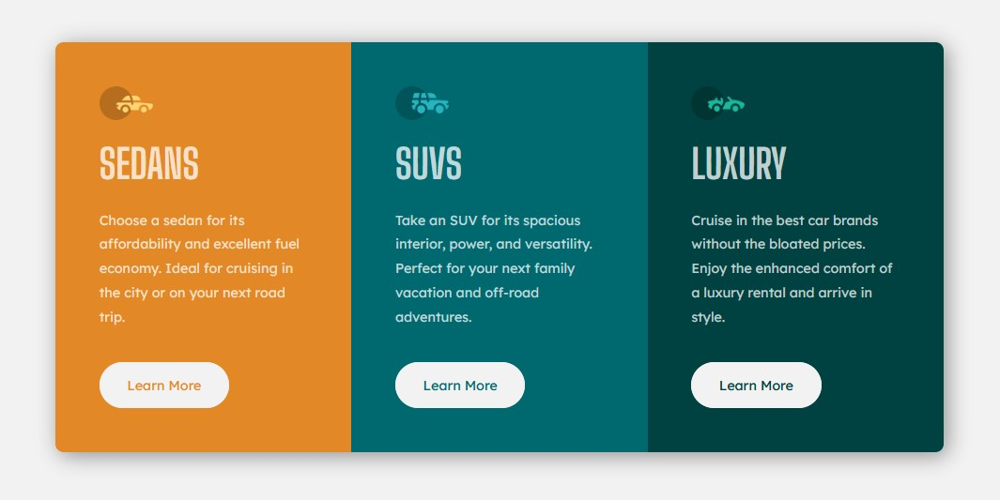

# Frontend Mentor - 3-column preview card component solution

This is a solution to the [3-column preview card component challenge on Frontend Mentor](https://www.frontendmentor.io/challenges/3column-preview-card-component-pH92eAR2-). Frontend Mentor challenges help you improve your coding skills by building realistic projects. 

## Overview

### The challenge

Users should be able to:

- View the optimal layout depending on their device's screen size
- See hover states for interactive elements

### Screenshot

### Links

- Solution URL: [Github repo](https://github.com/KellyCHI22/frontend-mentor-solutions/tree/main/06-3-column-preview-card)
- Live Site URL: [Solution demo](https://kellychi22.github.io/frontend-mentor-solutions/06-3-column-preview-card/)

### Built with

- Semantic HTML5 markup
- CSS custom properties
- CSS Flexbox
- Mobile-first workflow

## Author

- Website - [My Github homepage](https://github.com/KellyCHI22)
- Frontend Mentor - [@Hsin-tingCHI](https://www.frontendmentor.io/profile/Hsin-tingCHI)

## Acknowledgments

Thank you Frontend Mentor for the challenge!