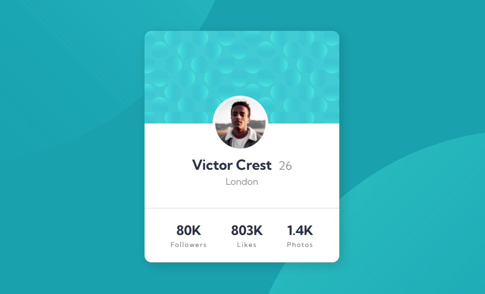

# Frontend Mentor - Profile card component solution

This is a solution to the [Profile card component challenge on Frontend Mentor](https://www.frontendmentor.io/challenges/profile-card-component-cfArpWshJ). Frontend Mentor challenges help you improve your coding skills by building realistic projects. 

## Overview

### Screenshot



### Links

- Solution URL: [Github repo](https://github.com/KellyCHI22/frontend-mentor-solutions/tree/main/08-profile-card-component)
- Live Site URL: [Solution demo](https://kellychi22.github.io/frontend-mentor-solutions/08-profile-card-component/)

### Built with

- Semantic HTML5 markup
- CSS custom properties
- CSS Flexbox

### What I learned

* The tricky part is to use two different backgrounds and put them to the right position. Use `vw` instead of `%` to avoid background changing according to the screen size.
```css
body {
  background-image: url('images/bg-pattern-top.svg'), url('images/bg-pattern-bottom.svg');
  background-repeat: no-repeat, no-repeat;
  background-position: right 50vw bottom 45vh, left 50vw top 45vh;
}
```

## Author

- Website - [My Github homepage](https://github.com/KellyCHI22)
- Frontend Mentor - [@Hsin-tingCHI](https://www.frontendmentor.io/profile/Hsin-tingCHI)

## Acknowledgments

Thank you Frontend Mentor for providing the challenge!
