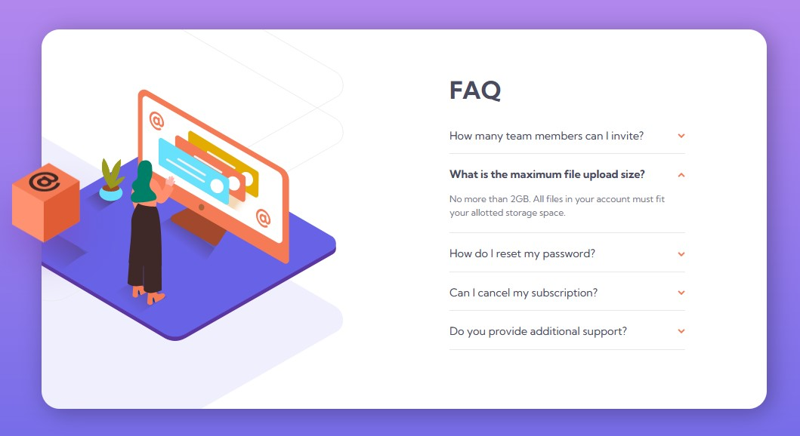

# Frontend Mentor - FAQ accordion card solution

This is a solution to the [FAQ accordion card challenge on Frontend Mentor](https://www.frontendmentor.io/challenges/faq-accordion-card-XlyjD0Oam). Frontend Mentor challenges help you improve your coding skills by building realistic projects. 

## Overview

### The challenge

Users should be able to:

- View the optimal layout for the component depending on their device's screen size
- See hover states for all interactive elements on the page
- Hide/Show the answer to a question when the question is clicked

### Screenshot

#### Mobile version

#### Desktop version


### Links

- Solution URL: [Github repo](https://github.com/KellyCHI22/frontend-mentor-solutions/tree/main/09-faq-accordion-card)
- Live Site URL: [Solution demo](https://kellychi22.github.io/frontend-mentor-solutions/09-faq-accordion-card/)

### Built with

- Semantic HTML5 markup
- CSS custom properties
- CSS Flexbox
- Mobile-first workflow

### What I learned

* Used `@keyframes` for box image animation
```css
.img-box {
        position: absolute;
        top: 190px;
        left: -90px;
        transition: transform 1s ease-in;
    }

body:hover .img-box,
body:focus .img-box {
    animation: up-and-down 1.25s linear infinite alternate;
}

@keyframes up-and-down {
    0% {
        transform: translateY(0%);
    }

    100% {
        transform: translateY(-20%);
    }
}
```
* Iterate over and hide other answers before displaying the clicked answer
```javascript
questions.forEach(question => {
    question.addEventListener("click", function () {
        let answer = question.nextElementSibling;
        if (answer.style.display === "block") {
            hideAnswer(question)
        } else {
            questions.forEach(question => {
                hideAnswer(question)
            })
            displayAnswer(question)
        }
    })
})
```

## Author

- Website - [My Github homepage](https://github.com/KellyCHI22)
- Frontend Mentor - [@Hsin-tingCHI](https://www.frontendmentor.io/profile/Hsin-tingCHI)

## Acknowledgments

Thank you Frontend Mentor for providing the challenge!

