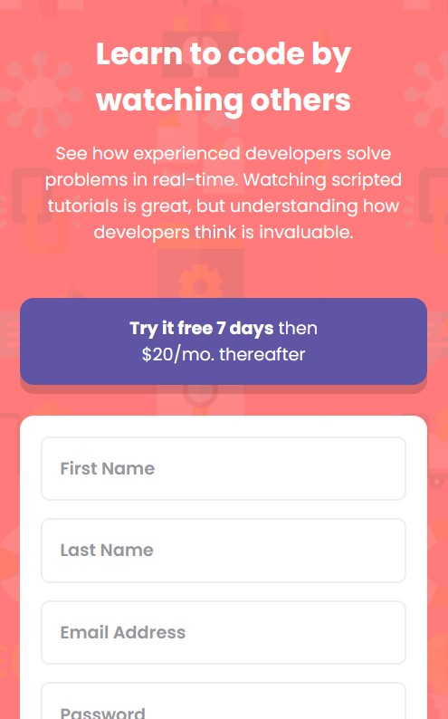
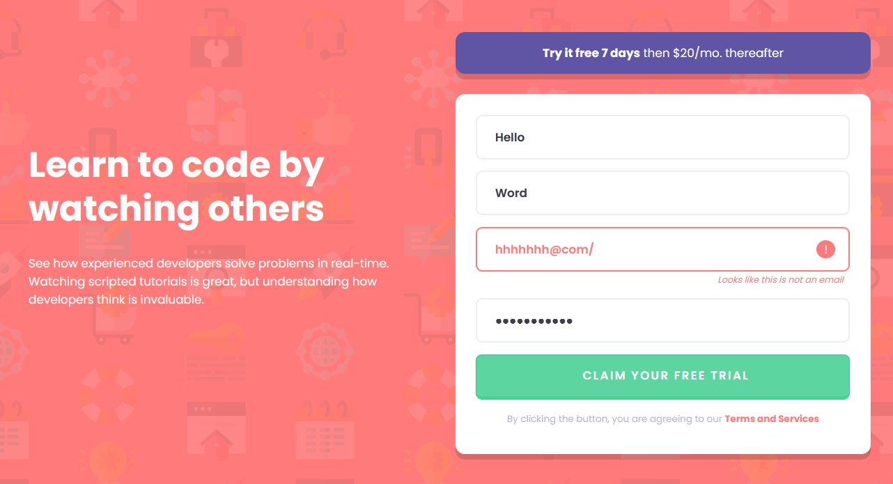

# Frontend Mentor - Intro component with sign up form solution

This is a solution to the [Intro component with sign up form challenge on Frontend Mentor](https://www.frontendmentor.io/challenges/intro-component-with-signup-form-5cf91bd49edda32581d28fd1). Frontend Mentor challenges help you improve your coding skills by building realistic projects. 


### The challenge

Users should be able to:

- View the optimal layout for the site depending on their device's screen size
- See hover states for all interactive elements on the page
- Receive an error message when the `form` is submitted if:
  - Any `input` field is empty. The message for this error should say *"[Field Name] cannot be empty"*
  - The email address is not formatted correctly (i.e. a correct email address should have this structure: `name@host.tld`). The message for this error should say *"Looks like this is not an email"*

### Screenshot
#### Mobile version

#### Desktop version

#### Active mode


### Links

- Solution URL: [Github repo](https://github.com/KellyCHI22/frontend-mentor-solutions/tree/main/11-intro-component-with-signup-form)
- Live Site URL: [Solution demo](https://kellychi22.github.io/frontend-mentor-solutions/11-intro-component-with-signup-form/)

### Built with

- Semantic HTML5 markup
- CSS custom properties
- CSS Flexbox
- Mobile-first workflow
- Vanilla JavaScript

### What I learned

#### 1. To stop the browser from doing default validation, you can add  `novalidate` to the form element.

```html
<form class="sign-up__form" action="" method="get" novalidate>
```
#### 2. Use regular expression for email validation
```js
function validateEmail(email, parent) {
    const validRegex = /^[a-zA-Z0-9.!#$%&'*+/=?^_`{|}~-]+@[a-zA-Z0-9-]+(?:\.[a-zA-Z0-9-]+)*$/;
    if (!email.value.match(validRegex)) {
        parent.classList.add('warning');
        email.style.color = 'var(--Red)';
    } else {
        parent.classList.remove('warning');
        email.style.color = 'var(--Dark-Blue)';
    }
}
```

### Useful resources

- [Email validation in javascript](https://www.simplilearn.com/tutorials/javascript-tutorial/email-validation-in-javascript) 


## Author

- Website - [My Github homepage](https://github.com/KellyCHI22)
- Frontend Mentor - [@Hsin-tingCHI](https://www.frontendmentor.io/profile/Hsin-tingCHI)

## Acknowledgments

Thank you Frontend Mentor for providing the challenge!