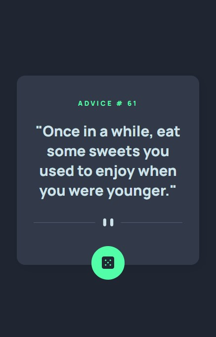
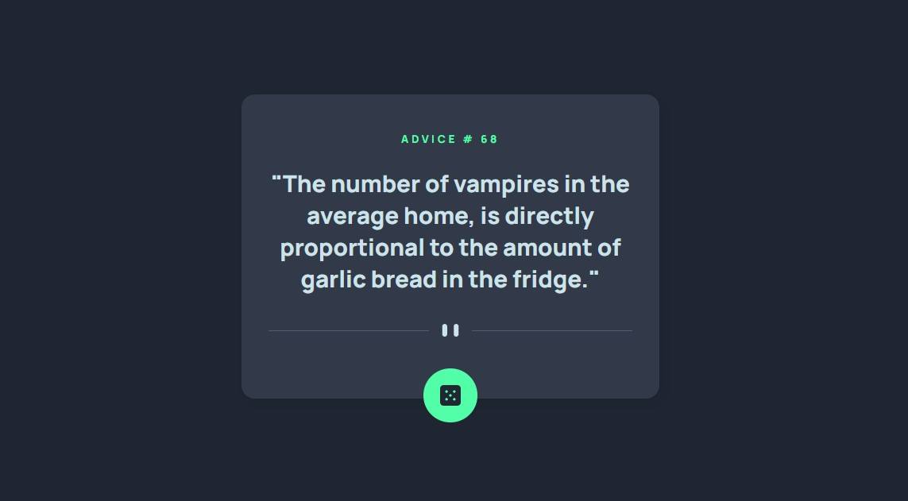
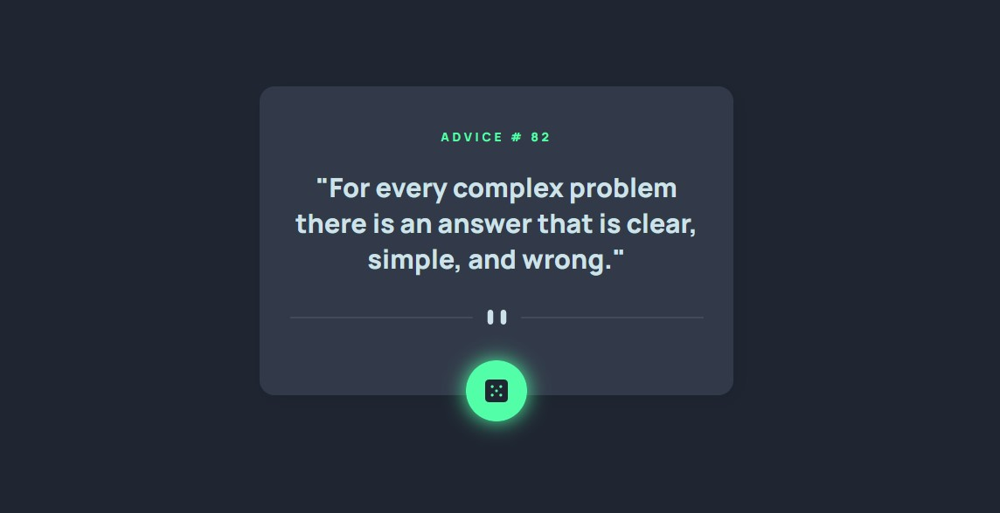

# Frontend Mentor - Advice generator app solution

This is a solution to the [Advice generator app challenge on Frontend Mentor](https://www.frontendmentor.io/challenges/advice-generator-app-QdUG-13db). Frontend Mentor challenges help you improve your coding skills by building realistic projects.

## Overview

### The challenge

Users should be able to:

- View the optimal layout for the app depending on their device's screen size
- See hover states for all interactive elements on the page
- Generate a new piece of advice by clicking the dice icon

### Screenshots
#### Mobile version

#### Desktop version

#### Active state


### Links

- Solution URL: [Github repo](https://github.com/KellyCHI22/frontend-mentor-solutions/tree/main/12-advice-generator-app)
- Live Site URL: [Solution Demo](https://kellychi22.github.io/frontend-mentor-solutions/12-advice-generator-app/)

## My process

### Built with

- Semantic HTML5 markup
- CSS custom properties
- CSS Flexbox
- Mobile-first workflow
- Vanilla JavaScript

### What I learned

Another fun practice with Api and Axios.
```js
function callAdvice() {
    let id = Math.floor(Math.random() * 225);
    axios
        .get(`https://api.adviceslip.com/advice/${id}`)
        .then(function (response) {
            const data = response.data.slip.advice;
            adviceId.innerText = id;
            advice.innerText = `"${data}"`;
        })
        .catch(function (error) {
            console.log(error);
        });
}
```

## Author

- Website - [My Github homepage](https://github.com/KellyCHI22)
- Frontend Mentor - [@Hsin-tingCHI](https://www.frontendmentor.io/profile/Hsin-tingCHI)

## Acknowledgments

Thank you Frontend Mentor for providing the challenge!