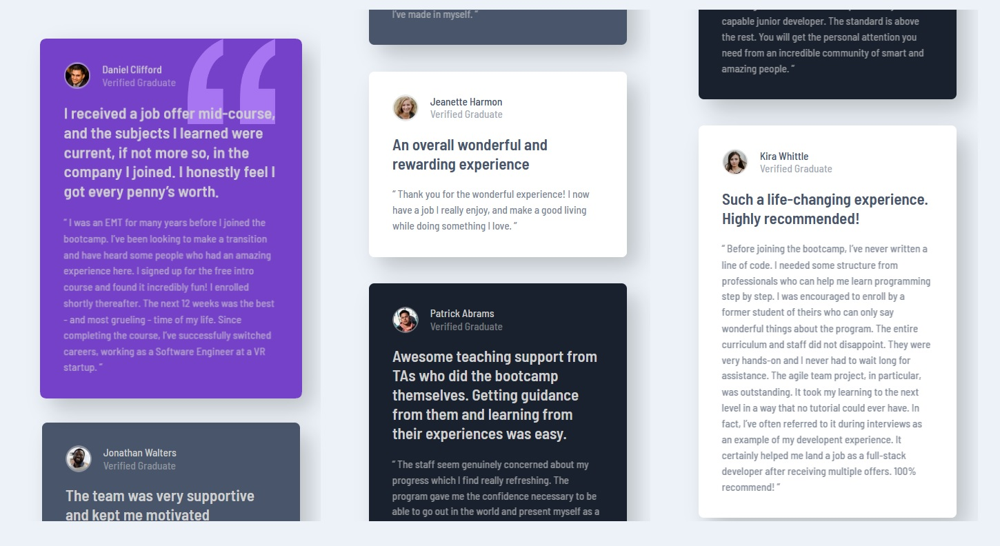
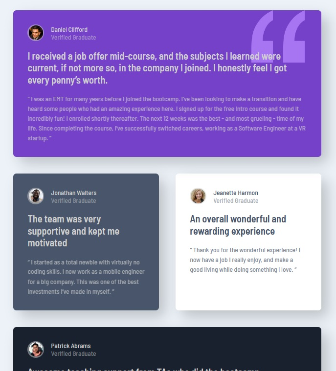
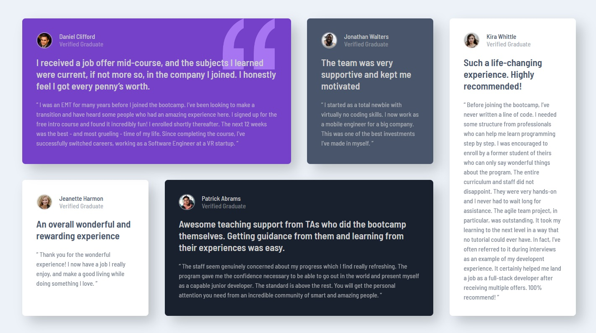

# Frontend Mentor - Testimonials grid section solution

This is a solution to the [Testimonials grid section challenge on Frontend Mentor](https://www.frontendmentor.io/challenges/testimonials-grid-section-Nnw6J7Un7). Frontend Mentor challenges help you improve your coding skills by building realistic projects. 

## Overview

### The challenge

Users should be able to:

- View the optimal layout for the site depending on their device's screen size

### Screenshots

#### Mobile version


#### Tablet version


#### Desktop version


### Links

- Solution URL: [Github repo](https://github.com/KellyCHI22/frontend-mentor-solutions/tree/main/15-testimonials-grid-section)
- Live Site URL: [Solution demo](https://kellychi22.github.io/frontend-mentor-solutions/15-testimonials-grid-section/)

## My process

### Built with

- Semantic HTML5 markup
- CSS custom properties
- CSS Flexbox
- CSS Grid
- Mobile-first workflow

### What I learned

It took me around one hour to finish this challenge. Once you are familiar with grid areas, this kind of design is very easy to achieve!

```css
@media (min-width: 600px) {

    .testimony-section {
        margin: 4rem auto;
        max-width: 600px;
        grid-template-columns: repeat(2, 1fr);
        grid-template-areas:
            "one one"
            "two three"
            "four four"
            "five five"
    }

    .testimony-one {
        grid-area: one;
    }

    .testimony-two {
        grid-area: two;
    }

    .testimony-three {
        grid-area: three;
    }

    .testimony-four {
        grid-area: four;
    }

    .testimony-five {
        grid-area: five;
    }

}

@media (min-width: 1000px) {

    .testimony-section {
        margin-bottom: 4rem;
        max-width: 1100px;
        grid-template-columns: repeat(4, 1fr);
        grid-template-areas:
            "one one two five"
            "three four four five"
    }
}
```

## Author

- Website - [My Github homepage](https://github.com/KellyCHI22)
- Frontend Mentor - [@Hsin-tingCHI](https://www.frontendmentor.io/profile/Hsin-tingCHI)

## Acknowledgments

Thank you Frontend Mentor for providing the challenge!