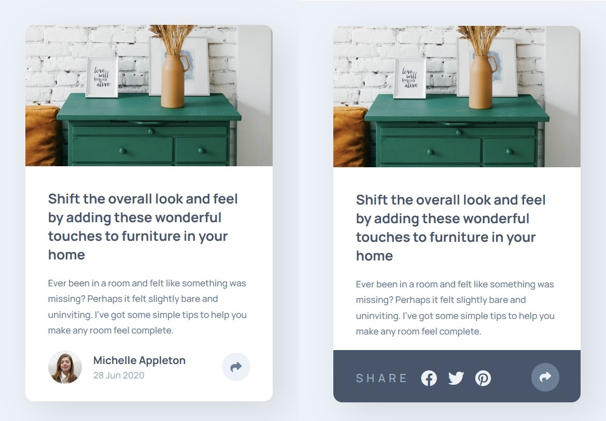
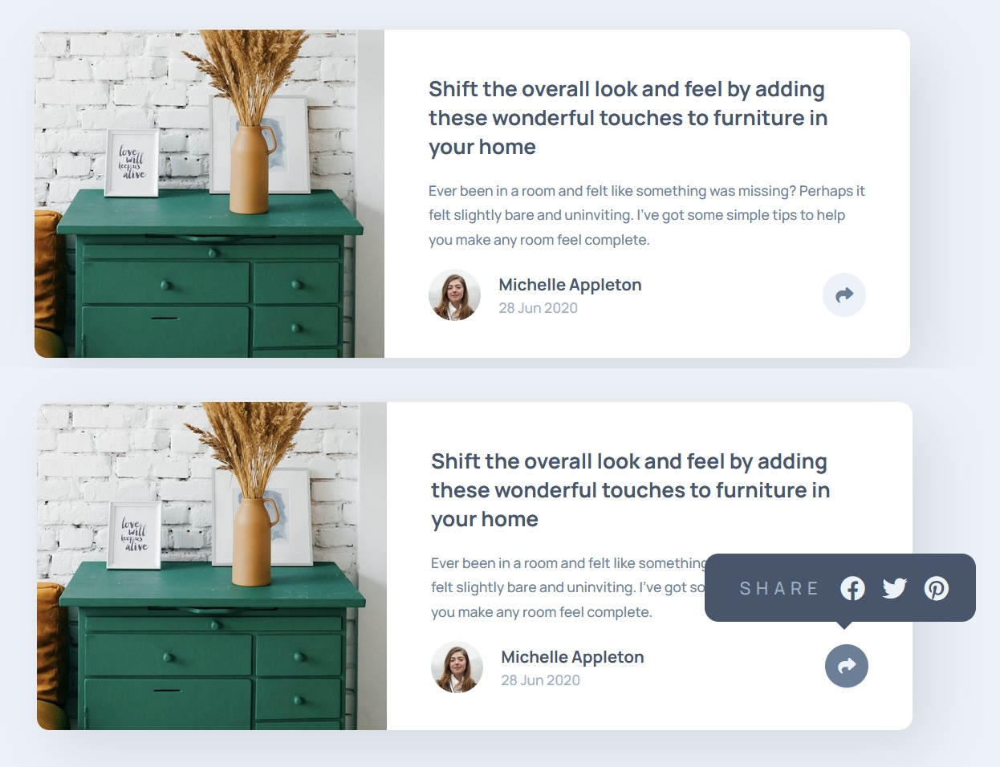

# Frontend Mentor - Article preview component solution

This is a solution to the [Article preview component challenge on Frontend Mentor](https://www.frontendmentor.io/challenges/article-preview-component-dYBN_pYFT). Frontend Mentor challenges help you improve your coding skills by building realistic projects. 

## Overview

### The challenge

Users should be able to:

- View the optimal layout for the component depending on their device's screen size
- See the social media share links when they click the share icon

### Screenshot

#### Mobile version


#### Desktop version


### Links

- Solution URL: [Github repo](https://github.com/KellyCHI22/frontend-mentor-solutions/tree/main/16-article-preview-component)
- Live Site URL: [Solution demo](https://kellychi22.github.io/frontend-mentor-solutions/16-article-preview-component/)

## My process

### Built with

- Semantic HTML5 markup
- CSS custom properties
- CSS Flexbox
- Mobile-first workflow
- Vanilla JavaScript

### What I learned

The tricky part is to make the JavaScript works on both mobile version and desktop version!

```js
const shareOpen = document.getElementById('share-icon-open');
const shareClose = document.getElementById('share-icon-close');
const shareOptions = document.getElementById('share-options');


shareOpen.addEventListener('click', () => {
    shareOptions.style.display = 'block';
});

shareClose.addEventListener('click', () => {
    shareOptions.style.display = 'none';
});
```

## Author

- Website - [My Github homepage](https://github.com/KellyCHI22)
- Frontend Mentor - [@Hsin-tingCHI](https://www.frontendmentor.io/profile/Hsin-tingCHI)

## Acknowledgments

Thank you Frontend Mentor for providing the challenge!