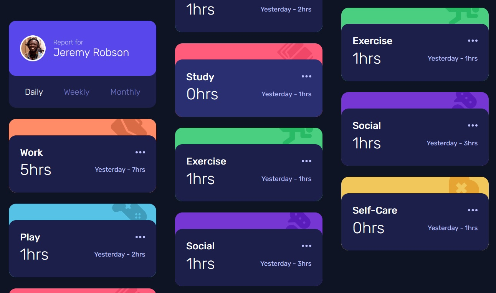
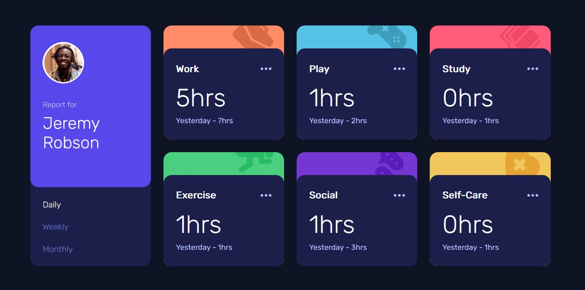
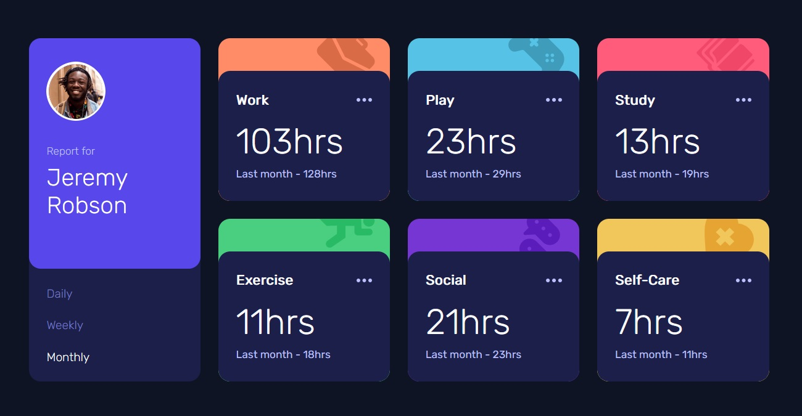

# Frontend Mentor - Time tracking dashboard solution

This is a solution to the [Time tracking dashboard challenge on Frontend Mentor](https://www.frontendmentor.io/challenges/time-tracking-dashboard-UIQ7167Jw). Frontend Mentor challenges help you improve your coding skills by building realistic projects. 

## Overview

### The challenge

Users should be able to:

- View the optimal layout for the site depending on their device's screen size
- See hover states for all interactive elements on the page
- Switch between viewing Daily, Weekly, and Monthly stats

### Screenshots
#### Mobile version

#### Desktop version - Daily mode

#### Desktop version - Monthly mode

### Links

- Solution URL: [Github repo](https://github.com/KellyCHI22/frontend-mentor-solutions/tree/main/17-time-tracking-dashboard)
- Live Site URL: [Solution demo](https://kellychi22.github.io/frontend-mentor-solutions/17-time-tracking-dashboard/)

## My process

### Built with

- Semantic HTML5 markup
- CSS custom properties
- CSS Flexbox
- CSS Grid
- Mobile-first workflow
- Vanilla JavaScript
- Local JSON file

### What I learned

I encountered some asynchronous problems when using fetch API to get my local JSON data. If I don't use `async` and `await`, timeData will not be able access the data from `data.json`. Another to note is that I should always `return` the promise, otherwise it's not going to work! 

⚠️ Remember to return the promise when using `fetch()`!

```js
const timeData = [];

async function getJSON() {
    return fetch('./data.json')
        .then(response => response.json())
        .then(data => timeData.push(...data))
        .catch(error => console.log(error));
}

await getJSON();
renderDashboard();
```

## Author

- Website - [My Github homepage](https://github.com/KellyCHI22)
- Frontend Mentor - [@Hsin-tingCHI](https://www.frontendmentor.io/profile/Hsin-tingCHI)

## Acknowledgments

Thank you Frontend Mentor for providing the challenge!